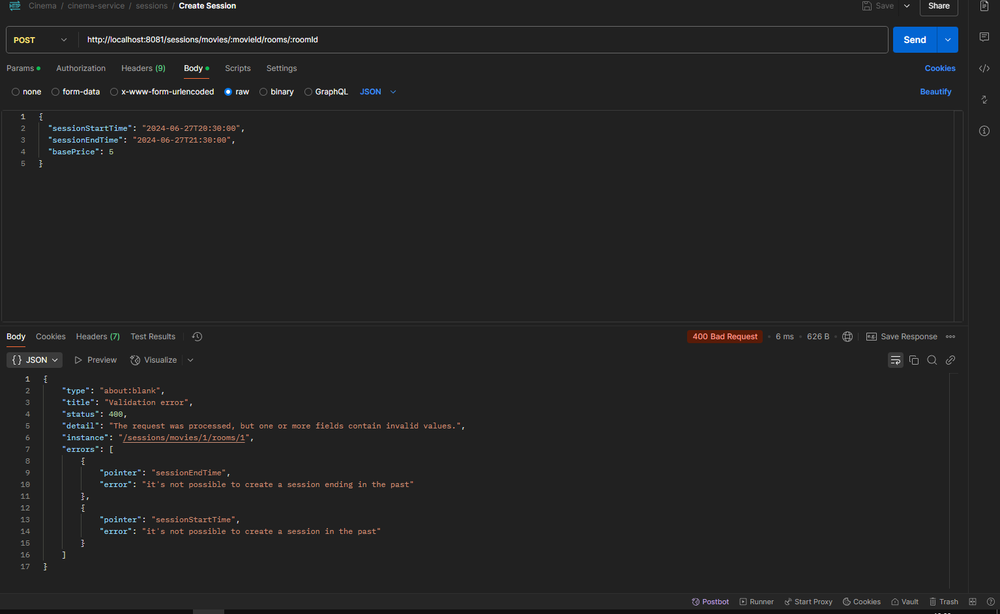

# Introduction
A REST API for a fictional cinema, created for study purposes.
This API is not the entry point for all services, as we have a discontinued and incompatible BFF: cineaart-bff.
However, we can access all resources directly without the BFF, except for the ticket purchase, which is processed via a queue initiated by the BFF.

This is an old project, and many endpoints don’t have clear names.

# What we can do with this API?
- Create and manage movies and sessions
- Create tickets with seat number, room number, and respective session
- Store movies images in **Amazon S3** or on local disk (by default at src/main/resources/static/images/movies directory)
- **Generate AI images** with **DALLE** from OpenAI

# Requirements
- Docker
- Docker Compose (comes with docker desktop for Windows users)
- Java 21
- AWS account
- (not required, but recommended) Terraform

# How to setup
1. At AWS, you need to create a directory in secrets manager named like this "cinema-service/secrets:

So you will need to create the following secrets at AWS Secrets Manager with their respective correct values:

amazon-accesskey (if you want to use S3 to store images)

amazon-secretkey (if you want to use S3 to store images)

openai-api-key (if you want to use DALLE from OpenAI)

Note: For testing purposes, if you don’t want to use Secrets Manager, you can remove the configuration in application.yaml for Secrets Manager (as shown in the image above) and set the values manually like this:

2. If you want to use S3 instead of local disk storage, you need to create a bucket and set the bucket name in application.yaml:

Alternatively, instead of manual creation, you can adapt the [Terraform script](infra/s3.tf) for a new bucket name and run it.

3. Also we have some environment variables:

image-provider can be "local-disk", or "simple-storage"

image-generator for now can be only "openai"

4. Currently, you need to create a room manually. We don’t have a controller for this yet.

# API Use examples

Generating a image:

Saving a movie image:

Creating a session

# Docs
Postman collection: [collection](docs/api-doc)

